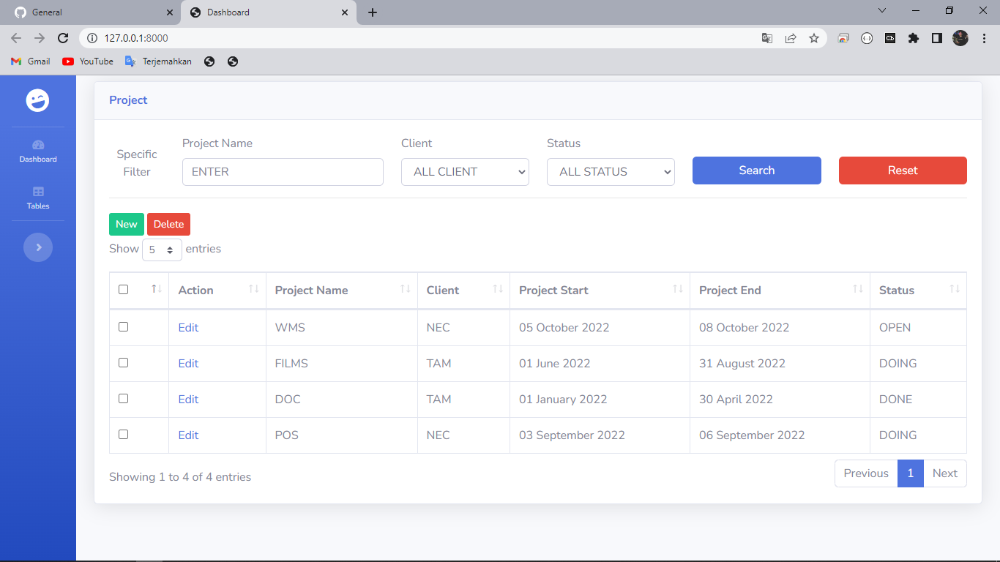

## Langkah-langkah memasang projek "Mini Project Afnan":

### Github:

-   Download Project ini dengan menekan tombol Code, lalu pilih Download ZIP
-   Jika Download telah selesai Ekstrak ZIP

### Requirement(s):

-   XAMPP Control Panel
-   PHP 8

### After Extract:

-   Buka aplikasi XAMPP Control Panel, start module Apache dan MySQL,  

-   Buka localhost di Browser dan buka PHPMyAdmin,
-   Buat Database baru dengan nama: <b>db_project_muzayyin</b>
-   Pilih database yang baru dibuat tersebut, import database melalui tab Import,
-   Di tab Import klik "choose file", cari file <b>db_project_muzayyin.sql</b> dari folder <b>mini-project-afnan</b>, kemudian impor
-   Selanjutnya, buka folder <b>mini-project-afnan</b> dengan Visual Studio Code, Sublime Text, dll
-   Buka terminal, ketikkan command: <b>composer update</b>
-   Buat file dengan nama <b>.env</b> di folder paling luar <b>mini-project-afnan</b>,
-   Isi file <b>.env</b> dengan meng-copy isi yang ada di file <b>.env.example</b> yang ada di folder paling luar <b>mini-project-afnan</b> lalu simpan,  

-   Setelah di copy, paste di file <b>.env</b> dan cari <b>DB_DATABASE=Laravel</b> kemudian di ganti dengan <b>DB_DATABASE=db_project_muzayyin</b>  

-   Setelah itu, buka terminal ketikkan command: <b>php artisan key:generate</b>
-   Selanjutnya, ketikkan perintah di terminal: <b>php artisan migrate</b>
-   Jika sudah, ketikkan perintah di terminal: <b>php artisan db:seed --class=RunThisSeeder</b>
-   Run project dengan mengetikkan perintah: <b>php artisan serve</b>
-   Maka akan muncul pesan: Server running On [http://127.0.0.1:8000]. Klik link tersebut.  

